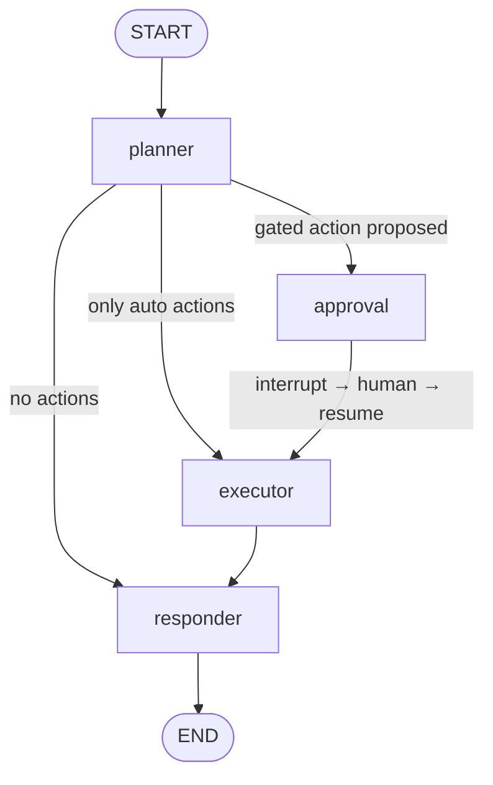
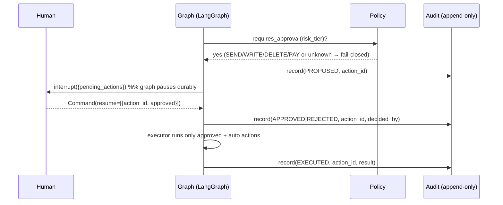

# ARCHITECTURE.md — atlas

System design for **atlas**, an agent-first enterprise workspace. This document describes the
layered architecture, the agent orchestration graph, how state / memory / approvals work, and the
key design trade-offs. For project rules and constraints see [`CLAUDE.md`](./CLAUDE.md).

---

## 1. Philosophy: agent-first

Traditional software puts apps at the center and bolts AI on top. **atlas inverts this.** A single
unified agent is the primary interface; apps become **tools** the agent orchestrates. The agent's
intelligence compounds through two knowledge graphs:

- **Personal Knowledge Graph (PKG):** per-user context, history, preferences.
- **Organizational Knowledge Graph (OKG):** company-wide knowledge, RBAC-scoped.

Because the agent takes **real, irreversible actions**, the architecture is built around a
**human-in-the-loop approval gate** and an **append-only audit trail**.

## 2. Layered Architecture

```
┌─────────────────────────────────────────────────────────────────────────────┐
│  INTERFACE LAYER            FastAPI · /chat /approve /threads + OIDC (M3.2/3.3) │
├─────────────────────────────────────────────────────────────────────────────┤
│  AGENT ORCHESTRATION LAYER  LangGraph state machine  ◄── THE CORE             │
│      planner → (approval/interrupt) → executor → responder                    │
├─────────────────────────────────────────────────────────────────────────────┤
│  INTEGRATION LAYER          Tool registry + tool adapters (email, calendar…)  │
├─────────────────────────────────────────────────────────────────────────────┤
│  KNOWLEDGE LAYER            PKG + OKG behind a typed repository interface      │
├─────────────────────────────────────────────────────────────────────────────┤
│  DATA LAYER                 Checkpointer (Postgres/SQLite/mem) + audit store  │
└─────────────────────────────────────────────────────────────────────────────┘
        ▲                                                                   ▲
        │  CROSS-CUTTING: Governance/Security (policy · RBAC · audit · confidence)
        │  CROSS-CUTTING: Observability (LangSmith tracing + eval)
```

### Layer responsibilities

| Layer | Responsibility | M1 status |
|---|---|---|
| **Interface** | HTTP surface; chat + approve/reject + thread reads | **built (M3.2)** |
| **Agent Orchestration** | Stateful graph: plan, gate, execute, respond | **built (M1)** |
| **Integration** | Declare tools (name, args schema, **risk tier**), run them | built (mock tools) |
| **Knowledge** | RBAC-scoped read/write of PKG + OKG | interface + stub (M2) |
| **Data** | Durable state checkpoints + audit persistence | memory/SQLite (M1), Postgres (M2) |
| **Governance** | `requires_approval` policy, RBAC, audit, confidence | policy + audit (M1) |
| **Observability** | LangSmith traces + evals | env-enabled (M1) |

## 3. Agent Orchestration Layer (the core)

A LangGraph `StateGraph` with four nodes and conditional routing.



ASCII view:

```
        ┌──────────┐   gated?   ┌───────────┐  approve/reject  ┌───────────┐
START ─►│ planner  ├───yes────► │ approval  ├─────(resume)────►│ executor  ├──► responder ──► END
        └────┬─────┘            │ interrupt │                  └─────▲─────┘
             │ only auto / none └───────────┘                        │
             └──────────────────────────────────────────────────────┘
```

### Node responsibilities

- **planner** — Reads the request (and, later, PKG/OKG context). Proposes tool calls. For each
  proposed call, the tool's **declared** `RiskTier` is looked up from the registry. *(LLM-driven
  when an API key is present; deterministic heuristic otherwise, so the system runs offline.)*
- **approval** — If any proposed action requires approval, calls `interrupt({pending_actions})`.
  The graph **pauses durably**. A human resumes with `Command(resume=<decisions>)`. Decisions are
  **bound to `action_id`**; decisions for unknown ids are ignored.
- **executor** — For each proposed action, **re-checks** the policy and (if gated) a matching
  approval **before** running it. Auto (READ) actions run directly; gated actions run only if
  approved. Produces `ActionResult`s.
- **responder** — Synthesizes the final answer with **sources** and a **confidence** score.

## 4. State Model

Graph state is a `TypedDict` (LangGraph channels), with structured values as **frozen** Pydantic
models. Only `messages` uses a reducer; other channels are last-write.

```
AgentState:
  messages:            list[AnyMessage]   # reducer: add_messages
  proposed_actions:    list[ProposedAction]
  approved_action_ids: list[str]
  rejected_action_ids: list[str]
  action_results:      list[ActionResult]
  sources:             list[str]
  confidence:          float | None
```

Action contracts (`frozen=True`, immutable):

```
RiskTier         = READ | WRITE | SEND | DELETE | PAY
ProposedAction   = { action_id, tool, args, risk_tier, rationale }
ApprovalDecision = { action_id, approved, decided_by }
ActionResult     = { action_id, tool, ok, output, error }
```

## 5. Memory Model

- **Short-term (working memory):** the checkpointed thread state above, keyed by `thread_id`.
  Durable across process restarts — this is what makes a paused approval survive.
- **Long-term (compounding memory):** PKG + OKG behind a `KnowledgeGraph` repository interface.
  Reads are RBAC-scoped by the caller's principal. M3.1 adds a durable `PostgresKnowledgeGraph`
  (full-text search, RBAC filter pushed into the SQL `WHERE` + re-checked via `can_read`); the
  in-memory stub remains the offline/test backend. Semantic retrieval (pgvector) is a later upgrade
  behind the same interface.

## 6. Approval Workflow (HITL)



The gate is enforced **in the executor**, not merely by graph shape: even if routing changed, the
executor refuses to run a gated action without a matching, in-scope `ApprovalDecision`.

## 7. Persistence & Checkpointing

- A **checkpointer factory** returns: `PostgresSaver` if `DATABASE_URL` is set (M2) → else
  `SqliteSaver` if a path is configured → else `InMemorySaver`.
- A checkpointer is **required** for `interrupt()`/resume to work. The checkpointer and the audit
  store share one `psycopg_pool.ConnectionPool` (autocommit + `dict_row`).
- Audit events are append-only **and hash-chained** (M2.1): each event stores
  `sha256(prev_hash || canonical(event))` over a deterministic canonical serialization, so any
  edit/insert/delete/reorder is caught by `verify_chain`. In-memory (`InMemoryAuditLog`) and Postgres
  (`persistence/audit_store.py`, advisory-lock-serialized appends, parameterized SQL) share the same
  chaining logic. A future Merkle/external-anchoring upgrade can replace the hash functions without
  touching storage.

## 8. Governance & Security

- **Risk classification is deterministic and tool-owned** — never inferred by the LLM.
- **Fail-closed** everywhere risk is uncertain.
- **Append-only audit** is the system of record for "who approved what, and what happened".
- **RBAC** scopes every knowledge read (defense against IDOR / privilege escalation).
- **Secrets** come only from env via Pydantic `Settings`.

## 9. Key Design Decisions & Trade-offs

| Decision | Alternative | Why we chose it |
|---|---|---|
| LangGraph `interrupt()` for HITL | Custom approval queue/state machine | Durable, battle-tested, less code to get wrong on the security-critical path |
| `TypedDict` channels + Pydantic payloads | Full Pydantic graph state | Matches LangGraph idioms (reducers) while keeping records type-safe & immutable |
| Tool-declared risk tiers | LLM-classified risk | Removes the model from the trust boundary; resists prompt injection |
| Fail-closed default | Fail-open (auto-run unknown) | Security posture: unknown ⇒ ask a human |
| Approval bound to `action_id` | Boolean "approved" flag on state | Prevents stale/replayed approvals authorizing a different action |
| KG behind an interface | Commit to Neo4j/pgvector now | Defer an expensive, hard-to-reverse infra decision; keep orchestration testable |
| Postgres checkpointer (M2) | Stay on SQLite | Production durability + concurrency for enterprise use |

## 10. Roadmap

- **M1 (this milestone):** runnable HITL core — policy, mock tools, the four-node graph, in-memory
  audit, SQLite/memory checkpointer, LangSmith via env, demo + tests.
- **M2.1 (done):** Postgres checkpointer + durable, **hash-chained** append-only audit store;
  docker-compose Postgres + a CI integration job; restart-resume + tamper-evidence proven by tests.
- **M2.2a (done):** RBAC + `Principal` threading — default-deny `can()`, tool-declared
  `required_permission`, deny-early (planner) + re-check-late (executor), `governance/` package split.
- **M2.2b (done):** `KnowledgeGraph` interface + in-memory stub, **RBAC-scoped retrieval** wired into
  the planner (`kg_context`); responder cites `kg:*` sources; `Entity` in the serde allowlist.
- **M2.2c (done):** `governance/confidence.py` — structured `Source` attribution +
  grounding-aware confidence (success ratio; grounded vs ungrounded when no actions ran).
- **M2.3 (done):** golden-trace evaluation gate — blocking deterministic security oracles
  (`evals/run_gate.py`) + optional non-blocking LangSmith quality evals; real `agent-eval` CI gate.
- **M3.1 (done):** durable `PostgresKnowledgeGraph` (`persistence/knowledge_store.py`) — Postgres
  full-text search behind the `KnowledgeGraph` interface; RBAC filter pushed into the SQL query;
  selected by `make_knowledge_graph` when `DATABASE_URL` is set; integration tests + demo.
- **M3.2 (done):** FastAPI Interface (`src/atlas/interface/`) — `/chat`, `/approve`, `/threads/{id}`
  over the compiled graph; **resume-time principal/thread binding** (caller must match the thread's
  checkpointed owner → 403); interim trusted-network header identity shim; consistent error envelope.
- **M3.3 (done):** real OIDC/JWT bearer auth (`src/atlas/interface/auth.py`, `PyJWT[crypto]`) —
  RS256 signature via JWKS, `iss`/`aud`/`exp` verified, claims→`Principal`, 401 on invalid/missing;
  the header shim is now a dev-only fallback. Config + deferred-work guide in `AUTH.md`.
- **M3.4 (done):** pluggable `PolicyStore` (`governance/policy.py` ABC + `InMemoryPolicyStore` +
  `persistence/policy_store.py` `PostgresPolicyStore`) replacing the hardcoded `ROLE_PERMISSIONS`;
  injected via `build_graph` into planner/executor/KG; empty Postgres table = deny-all; managed by
  `scripts/manage_policy.py`. See `AUTH.md`.
- **M3.5 (done):** hierarchical wildcard RBAC — a granted `kg:read:*` satisfies a required
  `kg:read:org`. One matching rule (`governance/rbac.py:permission_satisfied`) shared by both
  `PolicyStore` backends, the Postgres KG SQL read filter, and `can_read` (backend parity); wildcards
  expand on the granted side only. See `AUTH.md`.
- **Later:** per-principal rate limiting (M3.6); resource/argument-aware `ToolPermission`; pgvector
  semantic retrieval; real integrations (Gmail/Slack/Jira); SSE streaming; Merkle anchoring.
